# 📱 MediaExplorer — Flutter + MongoDB Atlas

Aplicación móvil desarrollada en Flutter para administrar una colección personal de videojuegos y explorar ofertas en tiempo real desde la API pública de CheapShark.

---

## 👥 Integrantes del equipo

| Nombre | Rol |
|---|---|
| Santiago Vargas | Conexion con API y base de datos |
| Kyara Altamirano | Diseño de UI/UX y navegación |


---

## 🌐 API utilizada: CheapShark

- **Sitio oficial:** https://www.cheapshark.com
- **Documentación:** https://apidocs.cheapshark.com
- **Tipo:** REST API pública, sin autenticación
- **Base URL:** `https://www.cheapshark.com/api/1.0`

### Endpoints implementados

| Método | Endpoint | Descripción | Parámetros usados |
|---|---|---|---|
| `GET` | `/deals` | Lista de ofertas de videojuegos paginada | `pageNumber`, `pageSize` |

#### Ejemplo de respuesta `/deals`

```json
[
  {
    "internalName": "HADES",
    "title": "Hades",
    "dealID": "abc123",
    "storeID": "1",
    "salePrice": "9.99",
    "normalPrice": "24.99",
    "thumb": "https://cdn.cheapshark.com/img/games/460x215/hades.jpg"
  }
]
```

#### Uso en el proyecto (`lib/services/cheapshark_service.dart`)

```dart
GET https://www.cheapshark.com/api/1.0/deals?pageNumber=0&pageSize=20
```

---

## 🗄️ Base de datos: MongoDB Atlas

- **Proveedor:** MongoDB Atlas (nube)
- **Colección:** `videojuegos`
- **Base de datos:** `moviles`
- **Paquete Dart:** [`mongo_dart ^0.10.8`](https://pub.dev/packages/mongo_dart)

### Esquema del documento

```json
{
  "_id": "ObjectId",
  "id": "uuid-string",
  "titulo": "Hades",
  "categoria": "Videojuego",
  "plataforma": "PC",
  "precio": 9.99,
  "stock": 1,
  "imagen": "https://...",
  "descripcion": "Desde CheapShark",
  "fuente": "CheapShark API"
}
```

---

## 🚀 Instrucciones de ejecución

### 1. Clonar el repositorio

```bash
git clone https://github.com/tu-usuario/flutter_mongo.git
cd flutter_mongo
```

### 2. Instalar dependencias

```bash
flutter pub get
```

### 3. Configurar la cadena de conexión a MongoDB

Abre `lib/db/mongo_database.dart` y reemplaza `_mongoUrl` con tu propia cadena si es necesario:

```dart
static const String _mongoUrl =
    'mongodb+srv://<usuario>:<password>@<cluster>.mongodb.net/<db>?retryWrites=true&w=majority';
```

### 4. Verificar dispositivos disponibles

```bash
flutter devices
```

### 5. Ejecutar la app en modo debug

```bash
flutter run
```

---

## 📦 Generar APK para Android

### Desde la terminal (VS Code o cualquier terminal)

```bash
flutter build apk --debug
flutter build apk --release
```

El archivo generado queda en:

```
build/app/outputs/flutter-apk/app-release.apk
```
o
```
build/app/outputs/flutter-apk/app-debug.apk
```

### Desde Android Studio

1. Abrir el proyecto en Android Studio (`File → Open`)
2. Ir al menú `Build → Flutter → Build APK`
3. El APK queda en la misma ruta indicada arriba

---

## 📁 Estructura del proyecto

```
lib/
├── db/
│   └── mongo_database.dart      # Conexión y CRUD con MongoDB Atlas
├── models/
│   └── item_coleccion.dart      # Modelo de datos
├── pages/
│   ├── home_page.dart           # Pantalla principal / menú
│   ├── collection_page.dart     # Lista de la colección personal
│   ├── form_page.dart           # Crear / editar items
│   ├── detail_page.dart         # Detalle de un item
│   ├── api_explorer_page.dart   # Explorar ofertas desde CheapShark
│   ├── statistics_page.dart     # Estadísticas de la colección
│   └── about_page.dart          # Información del equipo
├── services/
│   └── cheapshark_service.dart  # Consumo de la API CheapShark
├── utils/
│   └── snackbar_utils.dart      # Helpers para mensajes de usuario
├── widgets/
│   └── item_card.dart           # Tarjeta reutilizable de item
└── main.dart                    # Punto de entrada
```

---

## 📦 Dependencias principales

| Paquete | Versión | Uso |
|---|---|---|
| `mongo_dart` | `^0.10.8` | Conexión a MongoDB Atlas |
| `http` | `^1.6.0` | Llamadas HTTP a CheapShark |
| `uuid` | `^4.5.3` | Generación de IDs únicos |
| `cupertino_icons` | `^1.0.8` | Iconos iOS |

---

## 🔐 Permisos Android (`AndroidManifest.xml`)

```xml
<uses-permission android:name="android.permission.INTERNET"/>
<uses-permission android:name="android.permission.ACCESS_NETWORK_STATE"/>
```

| Permiso | Por qué |
|---|---|
| `INTERNET` | Conexión a MongoDB Atlas y CheapShark API |
| `ACCESS_NETWORK_STATE` | Verificar estado de red antes de conectar |

---

## ✨ Funcionalidades

- CRUD completo sobre MongoDB Atlas (crear, leer, actualizar, eliminar)
- Explorador de ofertas desde CheapShark con scroll infinito
- Guardar ofertas directamente en la colección personal
- Búsqueda por título
- Filtro por categoría y plataforma
- Estadísticas: precio promedio, máximo, mínimo, stock total, distribución por categoría y plataforma
- Vista de detalle con imagen expandida

---

## 📸 Capturas de pantalla

<p align="center">
  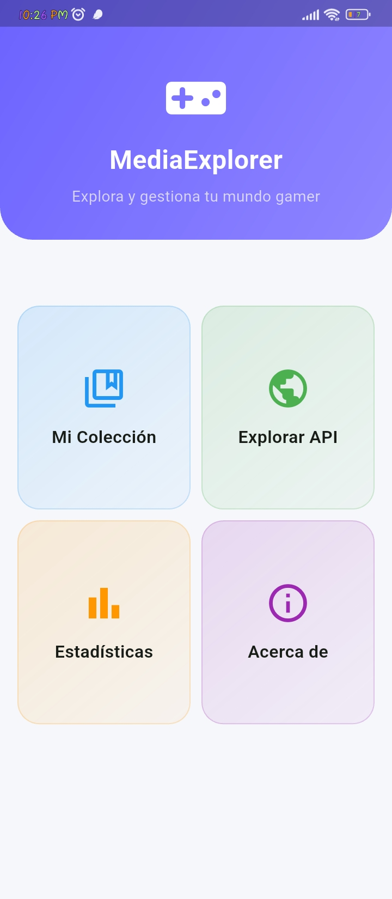
  &nbsp;&nbsp;
  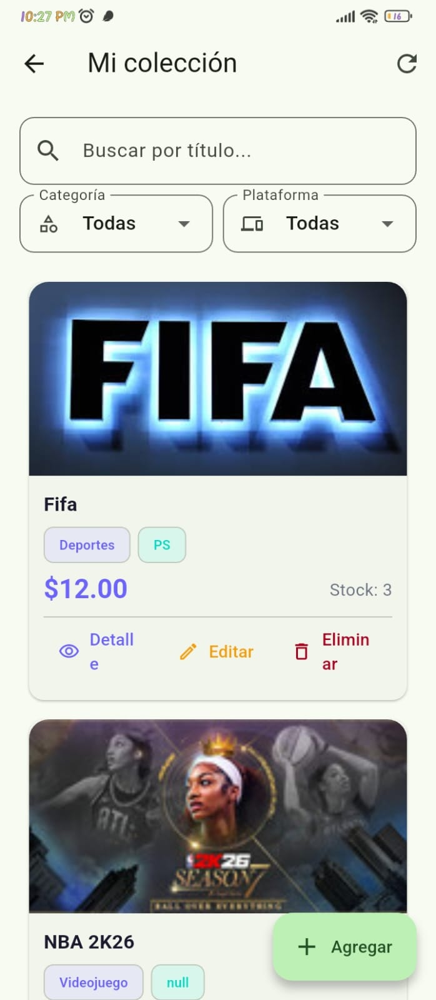
  &nbsp;&nbsp;
  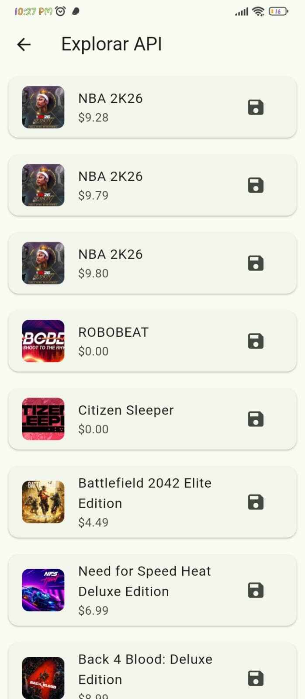
  &nbsp;&nbsp;
  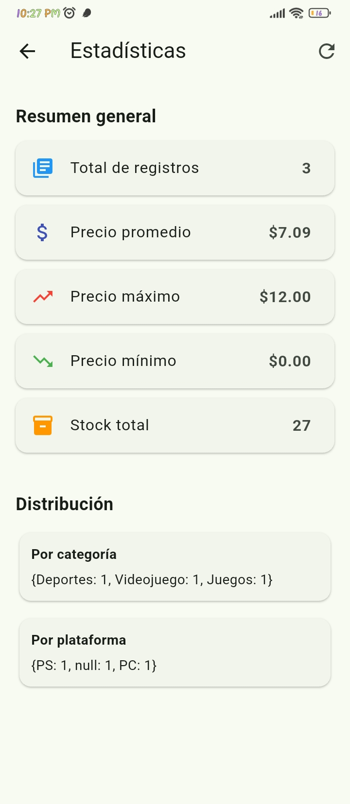
</p>

<p align="center">
  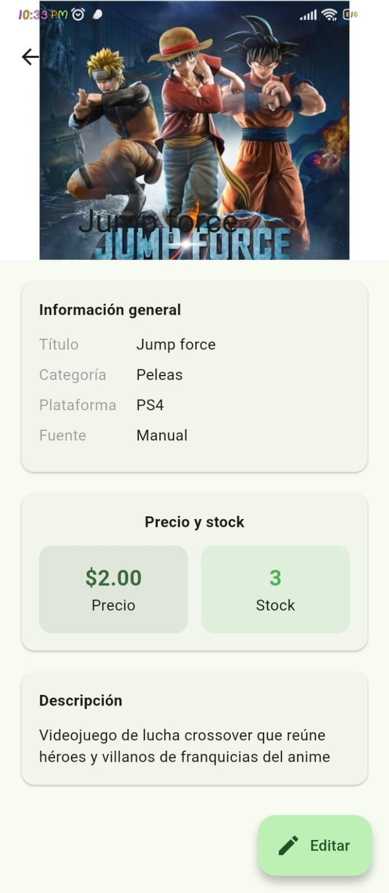
  &nbsp;&nbsp;
  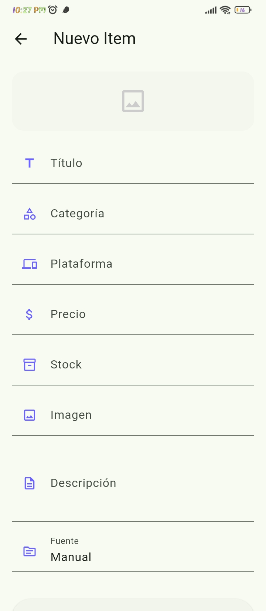
    &nbsp;&nbsp;
  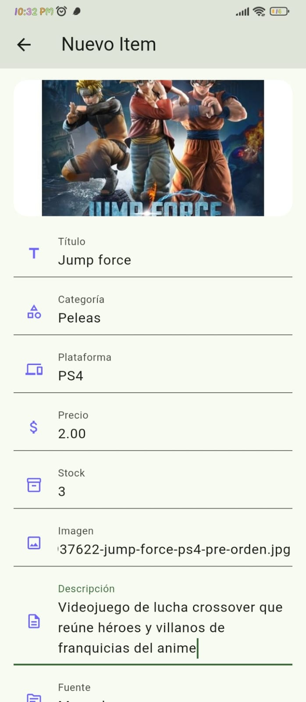
    &nbsp;&nbsp;
  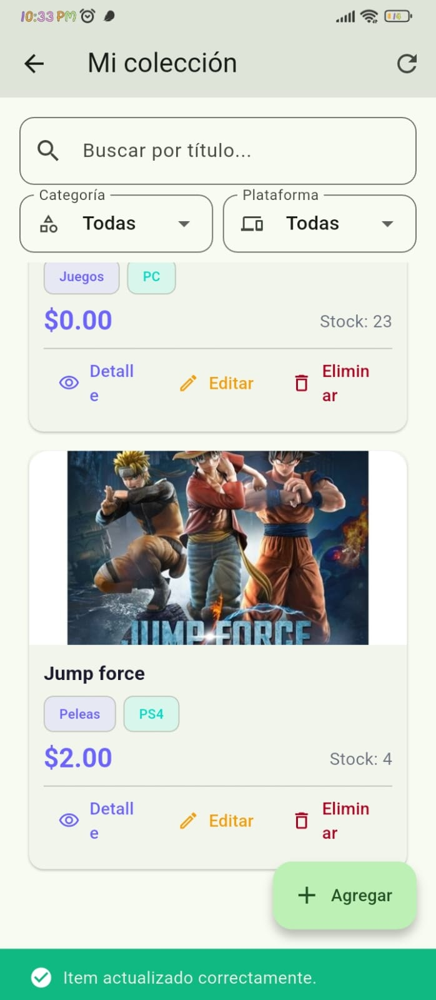
    &nbsp;&nbsp;
  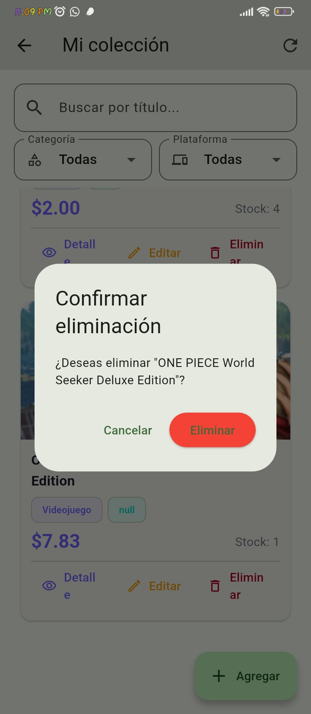
    &nbsp;&nbsp;
  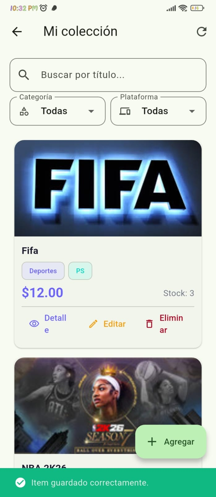
</p>

<p align="center">
  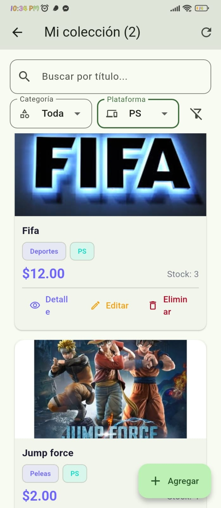
  &nbsp;&nbsp;
  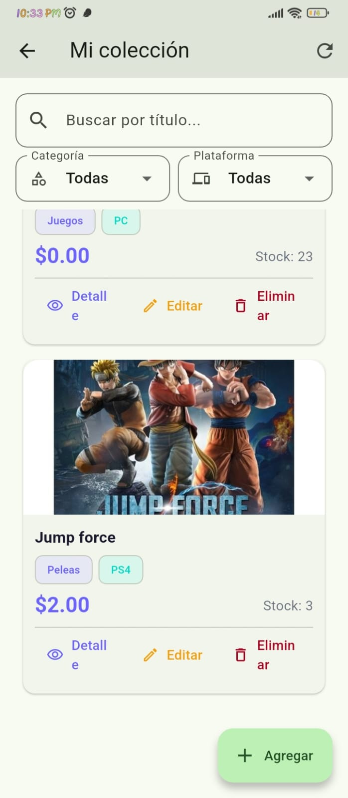
</p>
